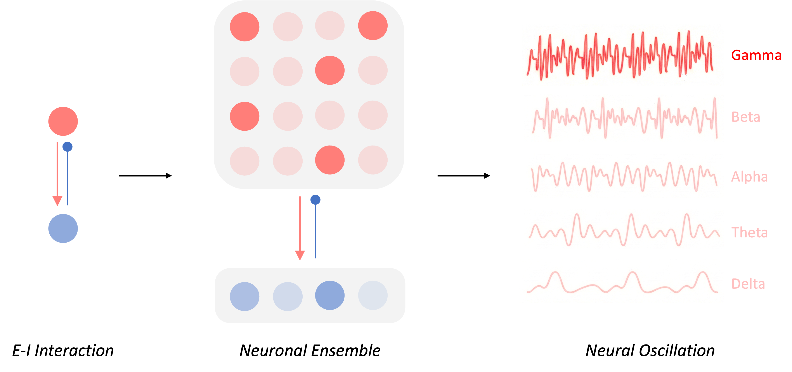

# E-I Playground

My playground for exploring cortical E-I interaction via computational methods.

## Motivation

I am wondering how E-I induced neural oscillation helps information processing and whether such mechanim can be applied to machine learning systems.

  

But during this process, I find myself know little about concepts and methods in computational neuroscience. So I made this repo public to push myself to learn it more :)

Hope u will also find it interesting!